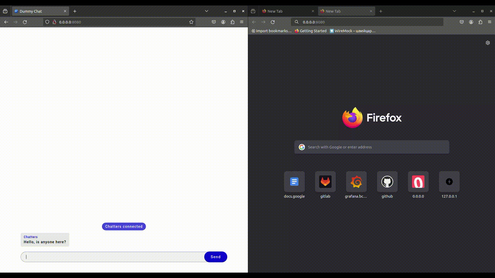

# Dummy Chat

## Description
Local webchat based on websockets. It allows to:
  - connect to chat;
  - pick certain username;
  - write messages;
  - reconnect after network troubles.

## Demo


## Launch

<br/>

```

make run

```
